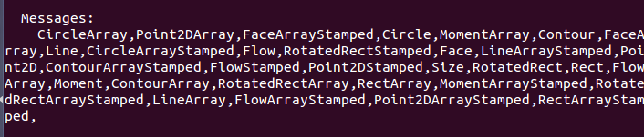
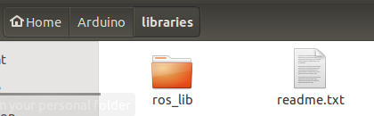
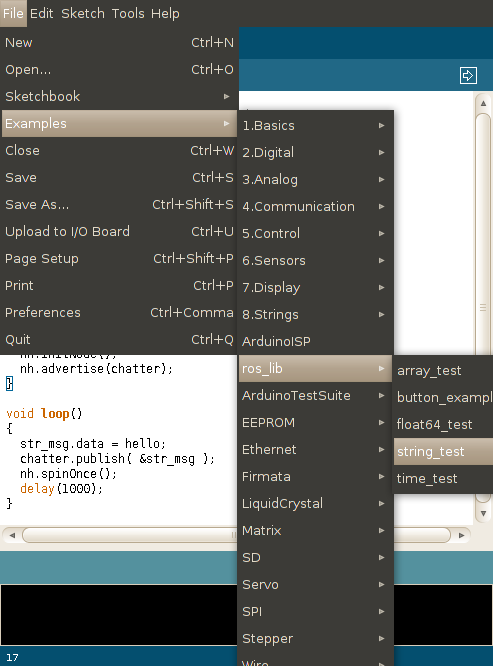

# IDE Setup steps (QtCreator)

## Ref urls
* http://wiki.ros.org/rosserial_arduino/Tutorials  

## Steps
> * `<sketchbook>` is the directory where the Linux Arduino environment saves your sketches.  
> * view or change the location of the `<sketchbook>` location from with the `Arduino IDE > File > Preferences` dialog  

1. install rosserial package (**RECOMMENDED**)  
`sudo apt-get install ros-jade-rosserial ros-jade-rosserial-arduino ros-jade-convex-decomposition ros-jade-ivcon`
2. Install ros_lib into the Arduino Environment  
```
cd <sketchbook>/libraries
rm -rf ros_lib
rosrun rosserial_arduino make_libraries.py .
```
with **NO ERROR** messages...

and get the folder...


3. check ros_lib   
restarting Arduino IDE, check ros_lib listed under examples sub menu:

