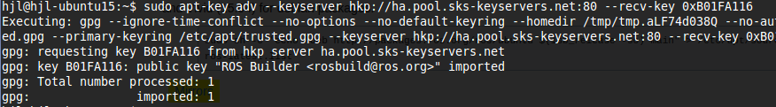

# ROS Setup steps
#### http://wiki.ros.org/kinetic/Installation/Ubuntu

1. setup sources.list  
`sudo sh -c 'echo "deb http://packages.ros.org/ros/ubuntu $(lsb_release -sc) main" > /etc/apt/sources.list.d/ros-latest.list`

2. setup keys  
`sudo apt-key adv --keyserver hkp://ha.pool.sks-keyservers.net:80 --recv-key 0xB01FA116`


3. update apt repo  
```
sudo apt update
apt-cache search ros-<ros-dist>
```

4. Installation  
```
sudo apt install ros-<ros-dist>-desktop-full
sudo rosdep init
rosdep update
```

5. Environment setup
```
echo "source /opt/ros/<ros-dist>/setup.bash" >> ~/.bashrc
source ~/.bashrc
```

6. install rosinstall  
`sudo apt install python-rosinstall`

7. visit package list  
`http://repositories.ros.org/status_page/ros_<ros-dist>_default.html`
