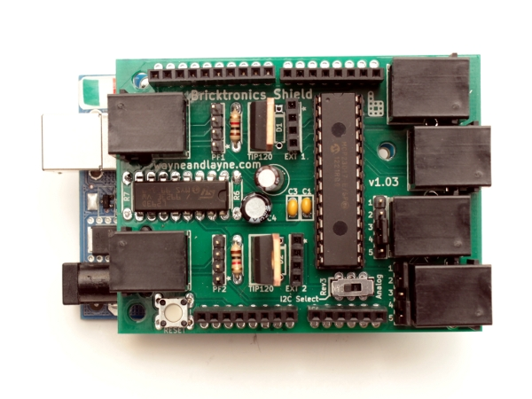

# Arduino to  Lego EV3
## 1. Get Bricktronics Shield
see http://www.wayneandlayne.com/projects/bricktronics-shield/


## 2. Get all required lib
see https://github.com/wayneandlayne/BricktronicsShield  
* Encoder: https://www.pjrc.com/teensy/td_libs_Encoder.html
* PID_v1: https://github.com/br3ttb/Arduino-PID-Library/
* Adafruit-MCP23017: https://github.com/adafruit/Adafruit-MCP23017-Arduino-Library
* BricktronicsShield: https://github.com/wayneandlayne/BricktronicsShield
* BricktronicsMotor: https://github.com/wayneandlayne/BricktronicsMotor
* BricktronicsButton: https://github.com/wayneandlayne/BricktronicsButton

or, simply extract LegoLib.zip and get all libs.

## 3.Add libs
Place the all library folder into your `<arduinosketchfolder>/libraries/` folder.  


## 4.Connect hardware


## 5.HelloWorld
```
#include <Wire.h>
#include <Adafruit_MCP23017.h>
#include <BricktronicsShield.h>
#include <Encoder.h>
#include <PID_v1.h>
#include <BricktronicsMotor.h>

long timeout = 0;

/**
   Create the motor1 object,
   correspond to the motors plugged into Motor Port 1 of the Bricktronics Shield.
*/
BricktronicsMotor m(BricktronicsShield::MOTOR_1);

boolean forward = false;

/**
   The setup() function is called once, on power on.
   Here, it’s used to initialize all the Bricktronics objects.
*/
void setup()
{
  Serial.begin(115200);
  BricktronicsShield::begin(); //begin BricktronicsShield
  m.begin(); //begin motor1
}

void loop() // In Arduino, your loop() function is called over and over again, until the Arduino runs out of power.
{
  if (forward) {
    Serial.println("Going forward.");
    m.setFixedDrive(255);
  } else {
    Serial.println("Going in reverse.");
    m.setFixedDrive(-255);
  }
  delay(2000);

  //Stop the motor and hold it in place
  m.hold();
  delay(1000);

  forward = !forward;
  delay(100);
}
```

## Run and have fun!
