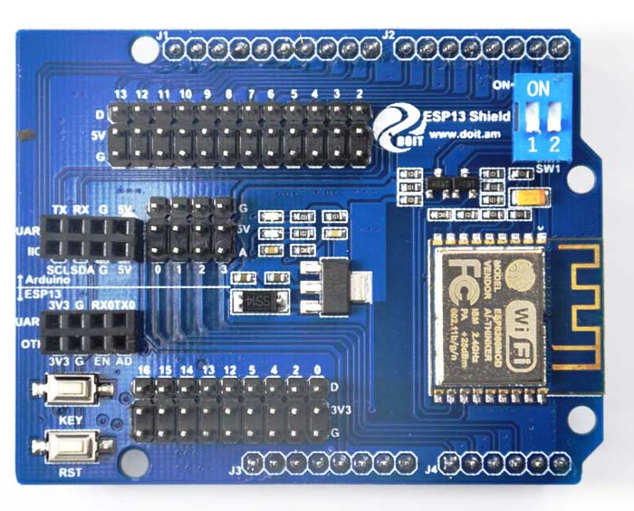
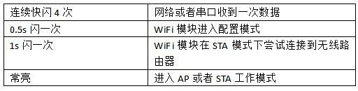
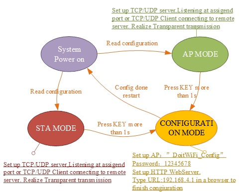
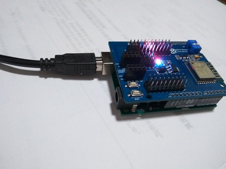
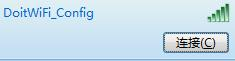
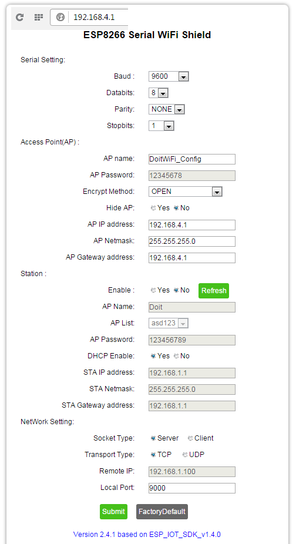
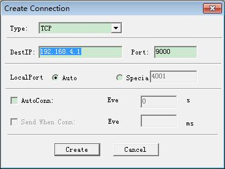
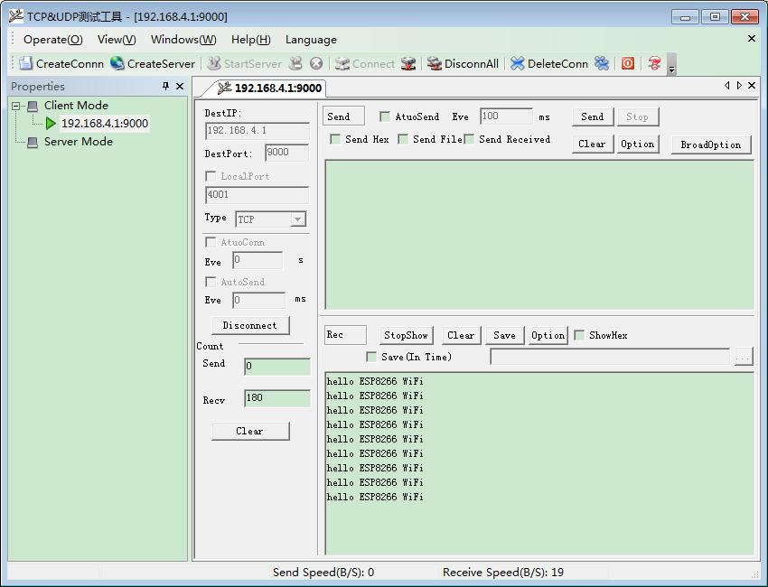
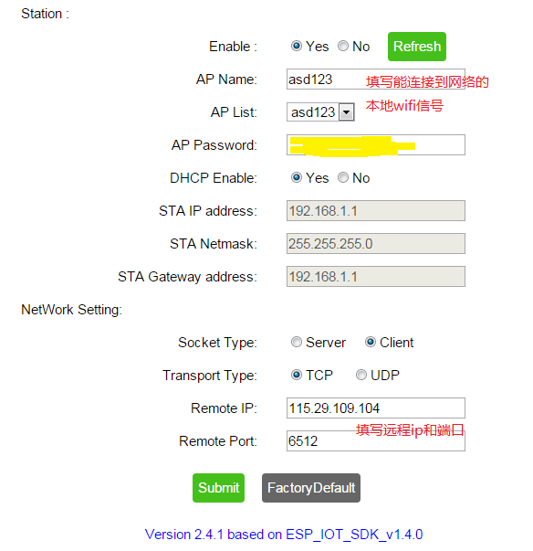

# Arduino Wifi Shield

## Hardware
  
* 官网: http://www.doit.am

## 技术规格
* 支持无线802.11 b/g/n 标准；
* 支持STA/AP两种工作模式；
* 内置TCP/IP协议栈，可以配置一个socket；
* 支持标准TCP/UDP Server和Client；
* 串口波特率支持： 1200/2400/4800/9600/19200/38400/57600/74800/ 115200 bps；
* 串口数据位：5/6/7/8位；
* 串口奇偶校验：无；
* 串口停止位：1/2位；
* 标准Arduino UNO、Mega引脚间距；
* 引出Arduino Pin 2/3/4/5/6/7/8/9/10/11/12/13；
* 引出ESP8266 GPIO 0/2/4/5/9/10/12/13/14/15/16/ADC/EN/UART TX/UART RX；
* RESET复位；
* KEY按键复用配置功能；
* 两位拨码开关实现Arduino和ESP8266串口扩展切换；
* WiFi工作电流：持续发送：≈70mA（200mA MAX），待机：<200uA；
* 无线传输速率：110-460800bps；
* 工作温度：-40℃～＋125℃
* 模块重量：约20g

## 指示灯含义
ESP8266串口WiFi扩展板有两个LED指示灯。红色为电源指示常亮LED。蓝色为多功能指示灯，其具体含义如下：
  

## Workflow



## 配置模式
1. arduino 连接盾板(开关1，2都off)  
  
2. 找到并连接连接信号  
  
3. 配置并保存(socket server)  
  


## Arduino数据转WiFi
1. 以下代码烧录至Arduino(不连接wifi盾板)
```
void setup() {
    Serial.begin(9600);
}
void loop() {
    delay(1000);
    Serial.println("hello ESP8266 WiFi");
}
```
2. 将拨码开关1/2均拨到ON位置。连接WiFi扩展板和Arduino的串口。上电。  
3. 连接wifi信号
4. 下载 tcp udp 调试工具  
http://bbs.doit.am/forum.php?mod=viewthread&tid=174&page=1&extra=#pid206  
5. 运行软件,创建连接  

6. 连接后，可以看到Arduino每隔1秒发送出来的数据，实现了串口数据向网络数据的传送。



## 连接远程服务器
1. 访问 http://tcp.doit.am 获得临时调试ip和端口
2. 进入配置模式(SW1,2 OFF)，配置并保存  

3. SW1,2 ON，连接Arduino，上电  
运行调试工具,创建连接  
可以看到Arduino每隔1秒发送出来的数据，实现了串口数据向网络数据的传送。  
