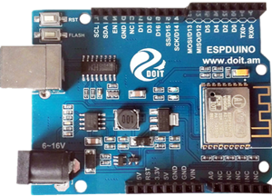
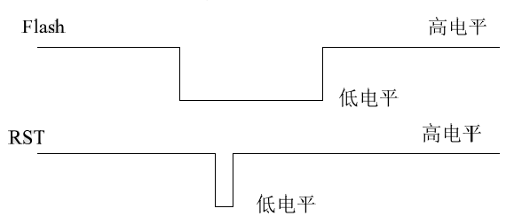

# ESPduino IDE HelloWorld

## Hardware  
  
http://cn.doit.am/

## 1.Install Arduino IDE
http://www.arduino.cc/en/main/software

## 2.Add Board Info
### 2.1 Add URL
File > Preferences > Additional Board Manager URLs:
http://espduino.doit.am/package_esp8266com_index.json
### 2.2 Add Board
Tools > Board > Boards Manager > Enter ESP8266 > install

## 3.Compile
Tools > Board > Generic ESP826,   
and then File > Examples > ESP8266 > Blink > Compile

## 4.Enter Flash Mode
press flash button on the ESPDuino board, then while it is pressed, press Reset,  
and then release reset, and then release flash button.  
That puts the ESPDuino into flash mode.  

## 5.Upload
Board Blink normal
