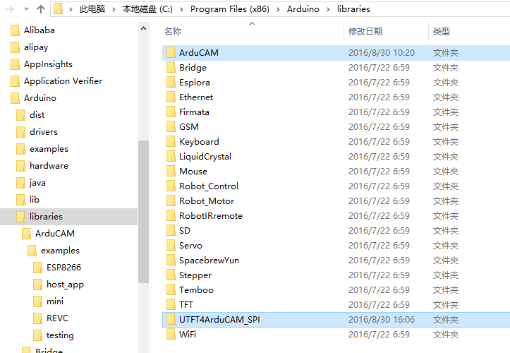

# ArduCAM-Mini-2MP Camera Shield HelloWorld

#### update on: 2016-08-30

## Steps
### 1. Download and install  
Download the latest ArduCAM firmware library from  
`https://github.com/ArduCAM/Arduino`  
unzip the library to the Arduino/libraries directory as below.   
  
> There are two libraries needed for ArduCAM shield, one is ArduCAM library and the other named UTFT4ArduCAM library which is derived from the UTFT library for the proper operation for the 3.2″ LCD.

### 2. copy lib to Arduino IDE  
copy [Download Path]/Arduino/ArduCAM to [Arduino IDE Path]/libraries
