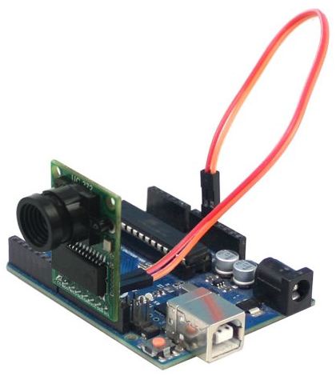
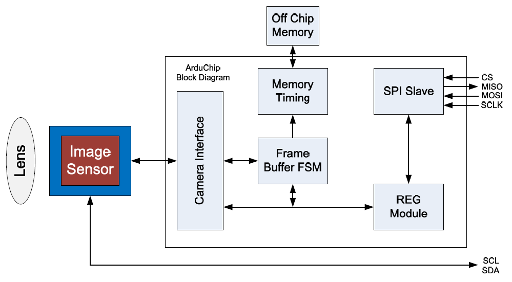
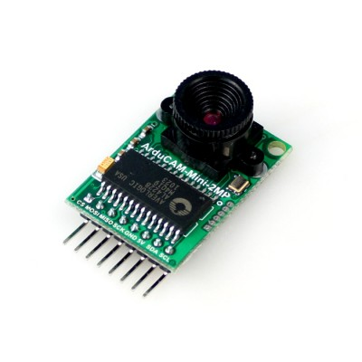
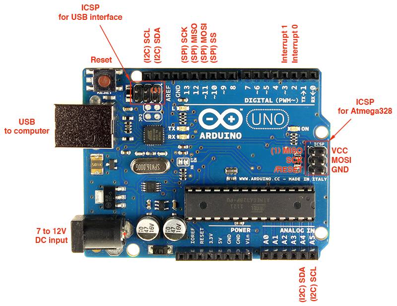

# ArduCAM-Mini-2MP Camera Shield HelloWorld

#### update on: 2016-08-26

## Pictures

## Purchase Link
http://www.uctronics.com/arducam-mini-module-camera-shield-w-2-mp-ov2640-for-arduino-uno-mega2560-board.html

## Block Diagram
This shield board is composed by lens, image sensor and an ArduChip.  
* The lens is changeable and can be mounted by S-mount (M12x0.5) or CS-mount lens holder.
* The image sensor is 2MP CMOS OV2640 from Omnivision.
* The ArduChip uses ArduCAM proprietary third generation camera controller technology which
handles the complex camera, memory and user interface hardware timing and provides a user
friendly SPI interface.

## Pin Definition
### Camera Shield Board

Pin No. | PIN NAME | TYPE | DESCRIPTION
------------ | -------------
1 | CS | Input | SPI slave chip select input
2 | MOSI | Input | SPI master output slave input
3 | MISO | Output | SPI master input slave output
4 | SCLK | Input | SPI serial clock
5 | GND | Ground | Power ground
6 | +5V | POWER | 5V Power supply
7 | SDA | Bi-directional | Two-Wire Serial Interface Data I/O
8 | SCL | Input | Two-Wire Serial Interface Clock

### ArduinoUno_R3_Pinouts.png

## Single Capture Mode
* Single capture mode is the default capture mode of the camera.   
* After issuing a capture command via SPI port, the ArduCAM will wait for a new frame and buffer the one entire image data to the frame buffer, and then assert the completion flag bit in the register.
* User only needs to poll the flag bit from the register to check out if the capture is done.

## Acronym
* ICSP = In-Circuit Serial Programming
* SPI = Serial Peripheral Interface  
  * SDI – 主设备数据输入，从设备数据输出
  * SDO – 主设备数据输出，从设备数据输入
  * SCLK – 时钟信号，由主设备产生
  * CS – 从设备使能信号，由主设备控制

* ISP = In-System Programmer
> https://www.arduino.cc/en/Tutorial/ArduinoISP  

* I2C(IIC)=Inter-Integrated Circuit, 完成集成电路或功能单元之间信息交换的规范或协议
> I2C总线采用一条数据线（SDA），加一条时钟线（SCL）来完成数据的传输及外围器件的扩展
