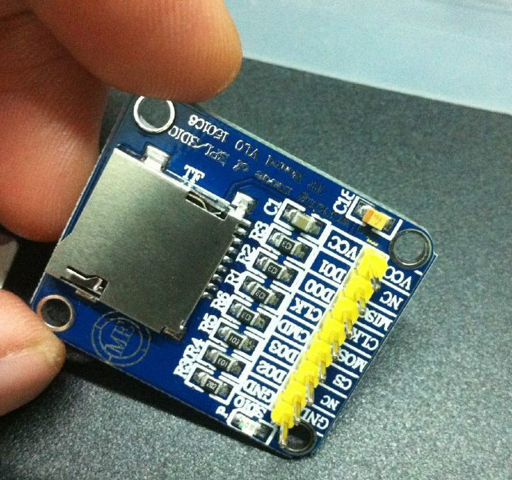
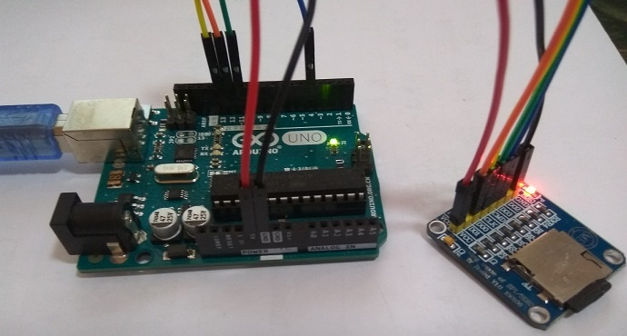
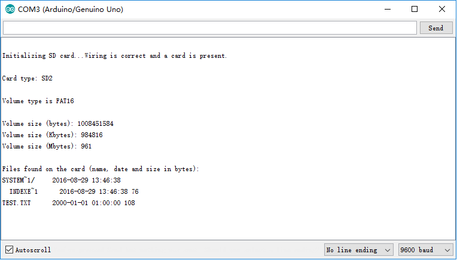

# TF Card HelloWorld
http://www.geek-workshop.com/thread-104-1-1.html

## Hardware

## Link
https://item.taobao.com/item.htm?spm=a1z09.2.0.0.KVhLYM&id=43762149466&_u=t1hkkt581f2

## Wire

## How to
1. Arduino IDE
2. File > Examples > SD > CardInfo
3. Compile , Upload, Run

## Result Capture Image

## Alternate SPI pins
https://www.pjrc.com/teensy/td_libs_SPI.html
> The main SPI pins are enabled by default. SPI pins can be moved to their alternate position with SPI.setMOSI(pin), SPI.setMISO(pin), and SPI.setSCK(pin). You can move all of them, or just the ones that conflict, as you prefer.

## Remark
* use 5v power supply
