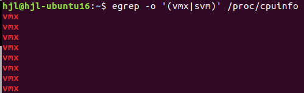
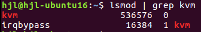
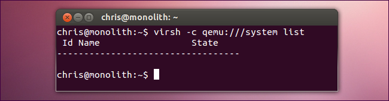

# Steps to install KVM (Ubuntu16)
## Determine hardware virtualization support
> egrep -c 'svm|vmx' /proc/cpuinfo  

A 0 indicates that your CPU doesn’t support hardware virtualization, while a 1 or more indicates that it does. You may still have to enable hardware virtualization support in your computer’s BIOS.

> egrep -o '(vmx|svm)' /proc/cpuinfo  

## Install libs
> sudo apt install qemu-system libvirt-bin virt-manager  
> sudo apt install qemu-kvm libvirt-bin bridge-utils virt-manager  

### confirm
> lsmod | grep kvm  

## Add to group
> sudo adduser [user] libvirtd  

### reboot and confirm  
> virsh -c qemu:///system list

## URLs
> http://www.howtogeek.com/117635/how-to-install-kvm-and-create-virtual-machines-on-ubuntu/  
>
